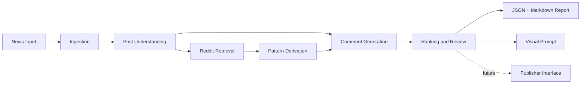

# 新闻“神评论” Agent

一个可演示、可扩展的 Agent：输入新闻内容，先理解帖子，再从 Reddit 风格样例中提炼互动模式，最后生成多风格“神评论”，并输出结构化结果与可读报告。

当前仓库已经完成第二阶段升级：
- 保留离线可跑的原型链路。
- 新增可插拔 `openai` 后端。
- 支持把图片 URL 或本地图片文件一并送入多模态理解阶段。

## 功能概览
- 输入新闻标题、正文、可选图片描述。
- 可选接入真实 OpenAI Responses API 进行分析、评论生成和排序。
- 支持 `image_urls` / `local_image_paths` 作为多模态输入。
- 分析新闻的核心观点、争议点、笑点/槽点和讨论切口。
- 从本地 Reddit 样例库中检索高互动评论并提炼“评论套路”。
- 生成 4 类评论风格：
  一针见血、抖机灵、引发争论、反问式。
- 对候选评论排序，选出主推评论。
- 为主推评论生成配图构思 prompt。
- 输出 `JSON` 结果和 `Markdown` 报告。

## 项目结构
```text
.
|-- main.py
|-- src/news_comment_agent/
|   |-- cli.py
|   |-- ingestion.py
|   |-- understanding.py
|   |-- reddit_retrieval.py
|   |-- patterns.py
|   |-- generation.py
|   |-- ranking.py
|   |-- reporting.py
|   `-- sample_data/
|-- tests/
|-- outputs/
`-- docs/
```

## 快速运行
要求：`Python 3.11+`

先复制一份本地配置：

```bash
cp agent_config.example.json agent_config.json
```

然后在 `agent_config.json` 里填写你自己的：
- `backend`
- `model`
- `api_base`
- `api_mode`
- `api_key`
- `proxy`
- `output_dir`

运行内置 Apple 样例：

```bash
python main.py --sample apple_news --output-dir outputs/apple_demo
```

使用 JSON 配置后的默认运行：

```bash
python main.py --url "https://example.com/news"
```

如果想临时覆盖配置中的某一项，再传命令行参数，例如：

```bash
python main.py --url "https://example.com/news" --model deepseek-v4-flash --output-dir outputs/override_run
```

使用自定义 JSON 输入：

```bash
python main.py --input-file path/to/news_input.json --output-dir outputs/custom_run
```

使用本地文本输入：

```bash
python main.py --text-file path/to/article.md --title "Copied Article" --source-url "https://example.com/post" --output-dir outputs/text_run
```

尝试直接抓取 URL：

```bash
python main.py --url "https://example.com/news" --output-dir outputs/url_run
```

如果你明确接受“抓取失败时回退到内置演示样例”，再加这个开关：

```bash
python main.py --url "https://www.ainvest.com/news/apple-100-billion-investment-sparks-market-rally-offers-glimpse-trump-tariff-carveout-framework-2508/" --allow-sample-fallback --output-dir outputs/url_run
```

说明：
- 当前仓库内置样例最适合演示。
- `--url` 使用标准库抓取文本，适合作为占位能力，不保证对所有网站都能完整解析。
- 默认情况下，`--url` 抓取失败会直接报错，不会假装已经分析了原文。
- 只有显式传入 `--allow-sample-fallback` 时，已知演示 URL 才会回退到本地样例。
- 对知乎这类强反爬/登录站点，推荐直接从浏览器复制正文到 `.txt` 或 `.md`，再用 `--text-file` 运行。

## 输入格式
`NewsInput` JSON 结构：

```json
{
  "source_id": "unique-id",
  "title": "News title",
  "url": "https://example.com/article",
  "body": "Full article text",
  "image_descriptions": [
    "Optional image description"
  ],
  "image_urls": [
    "https://example.com/image.jpg"
  ],
  "local_image_paths": [
    "assets/example.png"
  ],
  "metadata": {
    "topic_tags": ["apple", "tariffs"]
  }
}
```

## 输出内容
- `result.json`
  完整结构化结果，适合后续系统消费。
- `report.md`
  面向演示和人工阅读的报告。

## 系统设计
详细说明见 [docs/design.md](/d:/vs_practive/2025study/TEST/ths_agent/docs/design.md)。

### 架构概览


### 关键决策
- 先分析再生成：避免模型一步到位导致不可解释。
- 学模式不学句子：参考评论只用于提炼互动套路，不直接复写。
- 零第三方依赖：方便演示、提交和复现。
- 预留发布接口：第一版不接真实平台，避免被账号、权限和风控拖慢。

## AI 使用方式
详细 Prompt 设计见 [docs/prompts.md](/d:/vs_practive/2025study/TEST/ths_agent/docs/prompts.md)。

当前实现为了保证离线可跑，默认使用规则和模板模拟 Agent 行为，但系统边界已经按真实 LLM 流程拆开：
- `understanding`
  已支持切换到 OpenAI 多模态模型做文本+图片理解。
- `reddit_retrieval`
  可替换成 Reddit API / 搜索服务。
- `generation`
  已支持切换到 OpenAI 后端生成多条候选评论。
- `ranking`
  已支持切换到 OpenAI 后端作为 judge；默认仍可使用启发式排序。

## 配置文件
默认读取项目根目录下的 `agent_config.json`。

示例文件见 [agent_config.example.json](/d:/vs_practive/2025study/TEST/ths_agent/agent_config.example.json)。

推荐做法：
- 把真实 key、代理、模型配置写进本地 `agent_config.json`
- 这个文件已加入 `.gitignore`，不会默认提交
- 命令行只在临时覆盖时再传参数

## 第二阶段完成内容
- 新增 `RuntimeSettings` 和后端工厂，统一管理 `heuristic` / `openai` 两种运行模式。
- 新增 `prompts.py`，集中管理结构化 Prompt。
- 新增多模态输入通路：
  `image_urls` 和 `local_image_paths` 会在 `openai` 后端下进入理解阶段。
- 新增执行元数据输出：
  报告和 JSON 中会标记使用的后端与模型。

## 测试
使用标准库 `unittest`：

```bash
python -m unittest discover -s tests -v
```

覆盖点：
- 端到端流程可返回结果。
- 能生成多条候选评论。
- 理解结果中包含争议点和互动切口。
- `openai` 后端在缺失 API Key 时会给出明确错误。

## 已知限制
- Reddit 检索目前使用本地样例数据，不是真实在线检索。
- URL 抓取是轻量解析，不适合复杂动态网页。
- `openai` 后端虽已接入，但当前环境下未实际联网验证 API 调用。
- 评论安全审查是启发式规则，不是完整内容审核系统。

## 第二阶段建议
- 接入 Reddit 搜索/API 进行实时参考学习。
- 增加 `publisher` 插件接口，支持 Reddit/X/论坛发布。
- 增加 Web UI 展示评论候选与人工审核。
